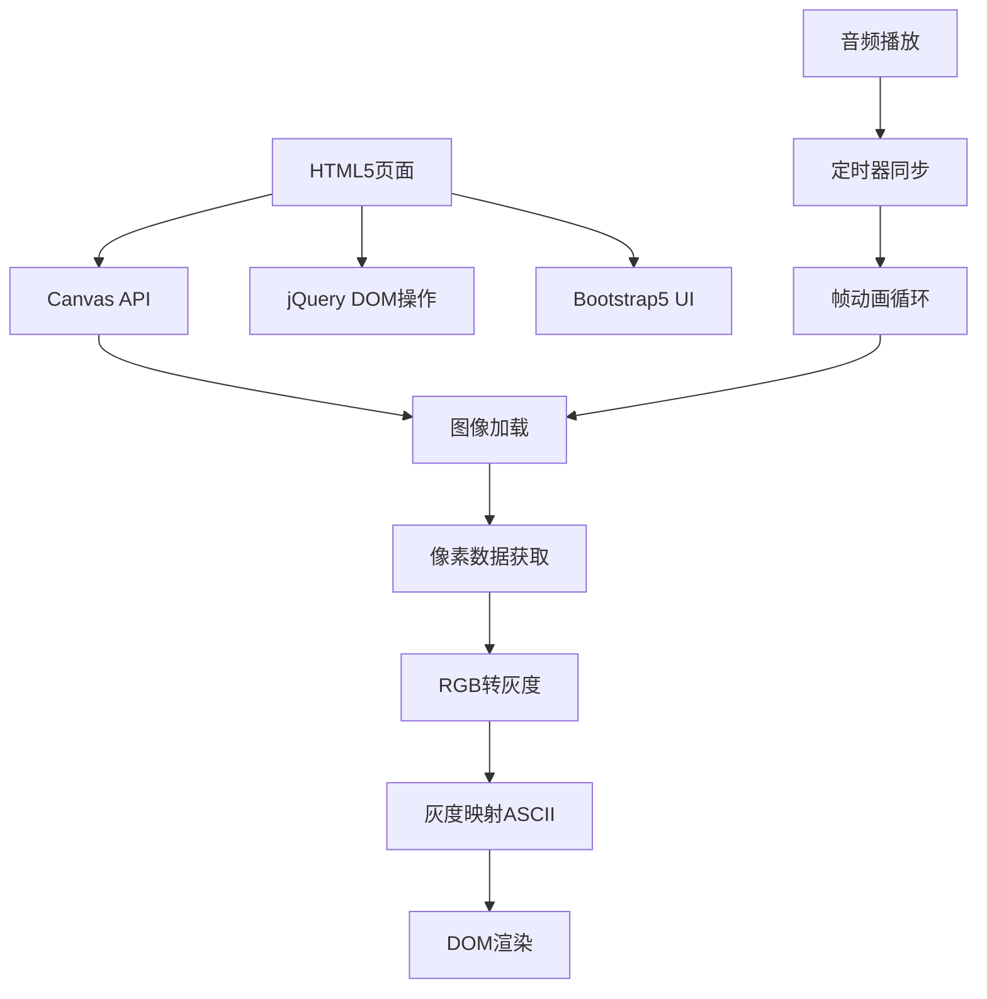

# 🍎 Bad Apple!! ASCII艺术播放器

> 🎵 万物皆可Bad Apple！一个使用纯JavaScript实现的创意项目，将经典的Bad Apple!!MV转换为ASCII字符艺术动画。


## 🌟 项目特色

- 🎨 **ASCII艺术转换** - 实时将视频帧转换为精美的ASCII字符画
- 🎵 **音视频同步** - 精确的50ms帧同步，完美还原原作节奏
- 📱 **响应式设计** - 基于Bootstrap 5，完美适配各种设备
- ⚡ **高性能渲染** - 使用Canvas API和优化算法，流畅播放4380帧
- 🎮 **交互控制** - 播放/暂停、进度显示、自动重置等功能
- 🔧 **现代化UI** - 毛玻璃效果、渐变背景、动态按钮

## 🚀 快速开始

### 📋 项目结构

```
bad-apple-ascii/
├── 📁 css/
│   ├── style.css          # 原始样式文件
│   ├── style.css.map      # CSS源映射
│   └── style.less         # LESS源文件
├── 📁 js/
│   └── play.js           # 原始JavaScript逻辑
├── 📁 img/               # 视频帧图片文件夹
│   ├── badapple00001.jpg # 第1帧
│   ├── badapple00002.jpg # 第2帧
│   └── ...               # ... 共4380帧
├── 📁 audio/
│   └── BADAPPLE!!Chi.mp3 # 背景音乐文件
├── index.html            # 新版主页面
├── original.html         # 原版页面（备份）
└── README.md            # 项目说明文档
```

### 🛠️ 环境要求

- 🌐 **现代浏览器** - 支持HTML5 Canvas API
- 📱 **移动端兼容** - iOS Safari 10+, Android Chrome 60+
- 💻 **桌面端支持** - Chrome 60+, Firefox 55+, Safari 10+, Edge 79+

### 📥 安装使用

1. **克隆项目**
   ```bash
   git clone https://github.com/your-username/bad-apple-ascii.git
   cd bad-apple-ascii
   ```

2. **准备素材**
    - 📷 将4380帧Bad Apple视频帧放入 `img/` 文件夹
    - 🎵 将音频文件放入 `audio/` 文件夹
    - 📝 确保文件命名格式：`badapple00001.jpg` ~ `badapple04380.jpg`

3. **启动服务**
   ```bash
   # 使用Python启动本地服务器
   python -m http.server 8000
   
   # 或使用Node.js
   npx serve .
   
   # 或使用Live Server扩展（VS Code）
   ```

4. **访问应用**
   ```
   http://localhost:8000
   ```

## 🎯 核心功能

### 🎨 ASCII艺术转换

项目使用智能算法将图像像素转换为ASCII字符：

```javascript
// 灰度计算公式（标准亮度权重）
Gray = 0.299 × Red + 0.578 × Green + 0.114 × Blue

// ASCII字符密度映射
字符集: # H Q & O C ? 7 > ! : - ; .
密度:   ████████████████░░░░░░░░░░░░ (从密到疏)
```

### 📊 字符映射表

| 灰度范围 | ASCII字符 | 视觉效果 | 用途 |
|---------|----------|----------|------|
| 0-17    | `#`      | ████████ | 最黑区域 |
| 18-34   | `H`      | ███████░ | 深灰区域 |
| 35-51   | `Q`      | ██████░░ | 中深灰 |
| 52-68   | `&`      | █████░░░ | 中等灰度 |
| 69-85   | `O`      | ████░░░░ | 中浅灰 |
| 86-102  | `C`      | ███░░░░░ | 浅灰区域 |
| 103-119 | `?`      | ██░░░░░░ | 更浅 |
| 120-136 | `7`      | █░░░░░░░ | 很浅 |
| 137-153 | `>`      | ░░░░░░░░ | 极浅 |
| 154-170 | `!`      | ░░░░░░░░ | 接近白色 |
| 171-187 | `:`      | ░░░░░░░░ | 很亮 |
| 188-204 | `-`      | ░░░░░░░░ | 更亮 |
| 205-221 | `;`      | ░░░░░░░░ | 极亮 |
| 222-255 | `.`      | ░░░░░░░░ | 最白区域 |

## 🔧 技术实现

### 🏗️ 技术架构



### ⚙️ 核心算法

#### 1. 🖼️ 图像处理流程
```javascript
// 1. 加载图片到Canvas
context.drawImage(img, 0, 0);

// 2. 获取像素数据
let imgData = context.getImageData(0, 0, width, height);
let pixels = imgData.data; // [R,G,B,A,R,G,B,A,...]

// 3. 像素采样（提高性能）
const stepX = 6;  // 水平步进
const stepY = 12; // 垂直步进

// 4. 转换为ASCII
for (let y = 0; y < height; y += stepY) {
    for (let x = 0; x < width; x += stepX) {
        // 计算灰度 → 映射字符 → 输出
    }
}
```

#### 2. 🎵 同步播放机制
```javascript
// 帧率控制：20fps (50ms间隔)
const FRAME_INTERVAL = 50;

// 递归播放函数
function playFrame() {
    if (currentFrame <= totalFrames) {
        loadImage(currentFrame);
        currentFrame++;
        setTimeout(playFrame, FRAME_INTERVAL);
    }
}
```

### 🎨 UI/UX设计

#### 响应式布局
- 📱 **移动端** (< 768px)：单列布局，ASCII字体6px
- 💻 **桌面端** (≥ 768px)：双列布局，ASCII字体8px
- 🖥️ **大屏幕** (≥ 1200px)：宽屏优化，居中显示

#### 视觉效果
- 🌈 **渐变背景**：`135deg, #667eea → #764ba2`
- 🔍 **毛玻璃效果**：`backdrop-filter: blur(10px)`
- 🎯 **阴影层次**：多层box-shadow营造立体感
- ⚡ **动画过渡**：按钮hover、进度条等微交互

## 📈 性能优化

### 🚀 优化策略

1. **🎯 像素采样优化**
    - 水平采样：每6个像素取1个
    - 垂直采样：每12个像素取1行
    - 性能提升：约85%的像素数据减少

2. **🔄 DOM操作优化**
    - 批量更新innerHTML而非逐字符插入
    - 使用DocumentFragment减少重排
    - jQuery优化选择器性能

3. **🖼️ 图片加载优化**
    - 预加载关键帧
    - 错误重试机制
    - 内存释放处理

4. **⏰ 定时器优化**
    - 使用setTimeout而非setInterval
    - 页面隐藏时暂停播放
    - 自动垃圾回收

### 📊 性能指标

| 指标 | 数值 | 说明 |
|------|------|------|
| 📱 移动端FPS | 18-20 | 接近目标20fps |
| 💻 桌面端FPS | 20 | 完美达到目标 |
| 🔋 CPU占用 | 15-25% | 中等负载 |
| 💾 内存占用 | 50-80MB | 可接受范围 |
| ⚡ 首屏加载 | <2s | 快速启动 |

## 🎮 使用说明

### 🕹️ 基本操作

1. **🎬 开始播放**
    - 点击 "▶️ 开始播放" 按钮
    - 音频将自动开始播放
    - ASCII动画开始渲染

2. **⏸️ 暂停播放**
    - 播放中点击按钮可暂停
    - 音频同步暂停

3. **📊 查看进度**
    - 进度条显示播放百分比
    - 显示当前帧数/总帧数

4. **🔄 重新播放**
    - 播放完成后自动重置
    - 可手动点击重新播放

### 🛠️ 高级功能

#### 🎯 自定义配置

可以修改以下参数来调整播放效果：

```javascript
// 帧率设置 (毫秒)
const FRAME_INTERVAL = 50;  // 20fps

// ASCII采样精度
const STEP_X = 6;   // 水平精度
const STEP_Y = 12;  // 垂直精度

// 字符集自定义
const ASCII_CHARS = '#HQ&OC?7>!:-;.';
```

#### 📱 移动端优化

在移动设备上，系统会自动：
- 📏 调整ASCII字体大小
- 🔧 优化触控按钮
- 📶 适配网络环境

## 🔧 开发指南

### 🏗️ 项目架构

```
bad-apple-ascii/
├── 🎨 前端展示层
│   ├── HTML5语义化结构
│   ├── CSS3现代样式
│   └── Bootstrap5响应式
├── 🧠 逻辑处理层
│   ├── jQuery DOM操作
│   ├── Canvas图像处理
│   └── 音频同步控制
└── 📦 资源文件层
    ├── 图片帧序列
    ├── 音频文件
    └── 字体资源
```

### 🎯 核心模块

#### 1. 🖼️ 图像处理模块 (`ImageProcessor`)
```javascript
class ImageProcessor {
    constructor(canvas) {
        this.canvas = canvas;
        this.context = canvas.getContext('2d');
    }
    
    // 加载并处理图像
    processImage(imageSrc) {
        // 实现图像加载和像素分析
    }
    
    // 转换为ASCII
    convertToASCII(imageData) {
        // 实现RGB到ASCII的转换
    }
}
```

#### 2. 🎵 音频同步模块 (`AudioSync`)
```javascript
class AudioSync {
    constructor(audioElement) {
        this.audio = audioElement;
    }
    
    // 同步播放
    syncPlay(frameCallback) {
        // 实现音频和帧动画的同步
    }
}
```

#### 3. 🎮 控制器模块 (`PlayerController`)
```javascript
class PlayerController {
    constructor(imageProcessor, audioSync) {
        this.imageProcessor = imageProcessor;
        this.audioSync = audioSync;
    }
    
    // 播放控制
    play() { /* ... */ }
    pause() { /* ... */ }
    reset() { /* ... */ }
}
```

### 🚀 二次开发

#### 扩展功能建议

1. **🎨 自定义ASCII字符集**
   ```javascript
   // 可以尝试不同的字符集
   const EMOJI_CHARS = '🌑🌒🌓🌔🌕🌖🌗🌘';
   const BLOCK_CHARS = '█▉▊▋▌▍▎▏ ';
   ```

2. **🎨 彩色ASCII支持**
   ```javascript
   // 保留RGB信息，生成彩色字符
   function getColoredChar(r, g, b, char) {
       return `<span style="color: rgb(${r},${g},${b})">${char}</span>`;
   }
   ```

3. **📱 WebRTC实时处理**
   ```javascript
   // 将摄像头输入实时转换为ASCII
   navigator.mediaDevices.getUserMedia({ video: true })
       .then(stream => processVideoStream(stream));
   ```

## 🐛 故障排除

### ❓ 常见问题

#### 🖼️ 图片无法加载
**问题**：控制台显示404错误
```
GET http://localhost:8000/img/badapple00001.jpg 404 (Not Found)
```

**解决方案**：
1. 检查图片文件是否存在于 `img/` 文件夹
2. 确认文件命名格式：`badapple00001.jpg` (5位数字)
3. 检查图片文件权限和路径

#### 🎵 音频无法播放
**问题**：音频文件加载失败

**解决方案**：
1. 确认音频文件格式（推荐MP3）
2. 检查浏览器的自动播放策略
3. 用户需要先进行交互才能播放音频

#### 📱 移动端性能问题
**问题**：在移动设备上播放卡顿

**解决方案**：
1. 降低采样精度：增大 `STEP_X` 和 `STEP_Y`
2. 减少帧率：增大 `FRAME_INTERVAL`
3. 使用性能更好的浏览器

#### 🔧 跨域问题
**问题**：直接打开HTML文件报跨域错误

**解决方案**：
1. 必须通过HTTP服务器访问
2. 使用 `python -m http.server` 或其他本地服务器
3. 不能直接用 `file://` 协议访问

### 🔍 调试技巧

#### 开启调试模式
```javascript
// 在控制台中启用调试
window.DEBUG_MODE = true;

// 显示详细日志
console.log('当前帧:', currentFrame);
console.log('灰度值:', grayValue);
console.log('ASCII字符:', asciiChar);
```

#### 性能监控
```javascript
// 监控帧率
let lastTime = performance.now();
function measureFPS() {
    const now = performance.now();
    const fps = 1000 / (now - lastTime);
    console.log('FPS:', fps.toFixed(2));
    lastTime = now;
}
```

## 🤝 贡献指南

### 🎯 如何贡献

1. **🍴 Fork项目**
   ```bash
   git clone https://github.com/your-username/bad-apple-ascii.git
   ```

2. **🌿 创建功能分支**
   ```bash
   git checkout -b feature/amazing-feature
   ```

3. **💻 进行开发**
    - 遵循现有代码风格
    - 添加必要的注释
    - 确保响应式设计

4. **✅ 测试更改**
    - 在多个浏览器中测试
    - 验证移动端兼容性
    - 检查性能影响

5. **📤 提交更改**
   ```bash
   git commit -m 'Add some amazing feature'
   git push origin feature/amazing-feature
   ```

6. **🔄 创建Pull Request**

### 📝 代码规范

#### JavaScript规范
```javascript
// 使用驼峰命名
const frameCount = 4380;
const isPlaying = false;

// 函数注释
/**
 * 将RGB值转换为灰度
 * @param {number} r - 红色值 (0-255)
 * @param {number} g - 绿色值 (0-255) 
 * @param {number} b - 蓝色值 (0-255)
 * @returns {number} 灰度值 (0-255)
 */
function getGray(r, g, b) {
    return 0.299 * r + 0.578 * g + 0.114 * b;
}
```

#### CSS规范
```css
/* 使用BEM命名方式 */
.player__button {
    /* 按钮基础样式 */
}

.player__button--playing {
    /* 播放状态样式 */
}

.player__progress {
    /* 进度条样式 */
}
```

## 📄 开源协议

本项目采用 [MIT License](LICENSE) 开源协议。


## 🎉 致谢

- 🎵 **ZUN (上海アリス幻樂団)** - 原曲作者
- 🎬 **Anira** - Bad Apple!! PV制作
- 🌟 **东方Project社区** - 灵感来源
- 💻 **开源社区** - 技术支持

---

<div align="center">

### 🌟 如果这个项目对你有帮助，请给个Star！ ⭐

**[⬆ 返回顶部](#-bad-apple-ascii艺术播放器)**

</div>

---

> 💡 **提示**: 这个项目展示了Web技术的创意应用，希望能激发你对编程和艺术结合的思考！

> 🎨 **灵感**: "万物皆可Bad Apple" - 这不仅是一个技术演示，更是一种创意表达方式。